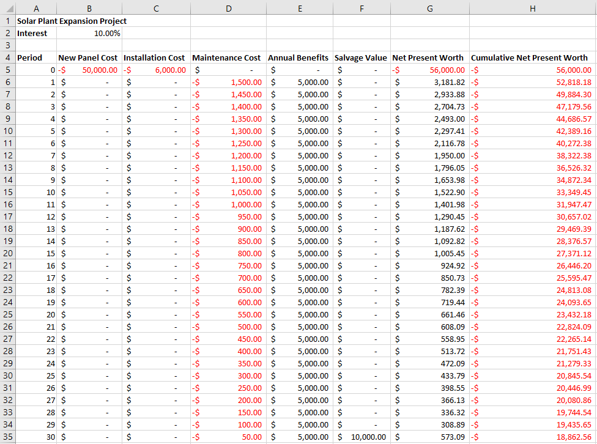

# PyEEA - A Python Engineering Economics Analysis Library


A Python3 library for performing engineering economics analysis. Styled using [Black](https://github.com/psf/black)

Developed by Thomas Richmond with help from MArkos Frazzer.

### Example

``` Python
# Create a project that uses an interest rate
from PyEEA import Project
spep = Project("Solar Plant Expansion Project", interest=0.10)

# Model our project using various cashflow models
from PyEEA import SinglePaymentFactory as sp
from PyEEA import UniformSeriesFactory as us
spep.add_cashflows([
    sp.Present( -50000,        title="New Panel Cost"),
    sp.Present( -6000,         title="Installation Cost"),
    us.Gradient(-1500, 30, 50, title="Maintenance Cost"),
    us.Annuity(  5000, 30,     title="Annual Benefits"),    
    sp.Future(   10000, 30,    title="Salvage Value")
])

# Valuate our project
print("PROJECT VALUATIONS:")
print("\tNet Present Worth:", spep.npw())        # -$18,578.88(P)
print("\tBenefit-Cost Ratio:", spep.bcr())       # 0.71971860...
print("\tInternal Rate of Return:", spep.irr())  # 0.06153851...
print("\tModified IRR:", spep.mirr())            # 0.08531792...

# Export our project as an Excel file
from PyEEA.output import write_excel, SpreadsheetFeature as ssft
write_excel("SPEP_Finances.xlsx", spep,
            features=[ssft.NPW, ssft.CNPW])
```

The above code outputs the following spreadsheet:



## Installation

For now, the library is local. Install this module locally to *site-packages* or a directory of your choice.

## Documentation

Refer to the [PyEEA Wiki](https://github.com/ThomasJFR/PyEEA/wiki) for documentation. 

## Pronunciation

Proncounced ["Paella"](https://howdoyousaythatword.com/word/paella-spanish/)
